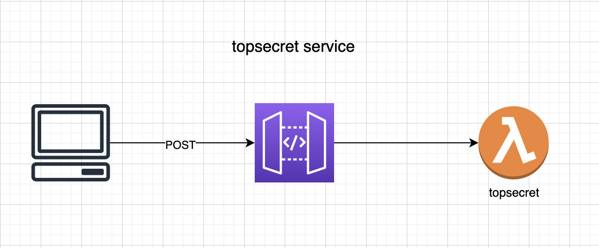
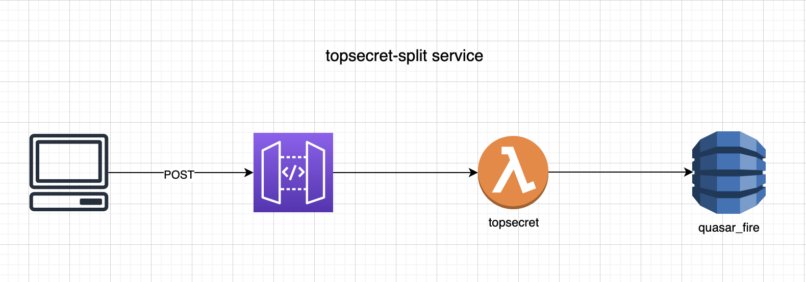

# Prueba operación fuego de quasar

## Diagrama de arquitectura



## Instrucciones de lanzamiento
- Se debe crear el archivo credentials en `~/.aws/credentials` con la siguiente estructura:

  [default]
  aws_access_key_id=
  aws_secret_access_key=

- Se debe tener previamente creada una tabla en dynamo llamada `quasar_fire`:
  - Primary key `:pk string`
  - Sort key `:sk string`
- Descargar el repositorio
- ingresar a la carpeta de cada lambda `topsecret` `topsecret-split` y ejecutar:
  - `make build`
  - `SLS deploy`
  - Esperar a que finalice el despliegue, copiar las url generadas y usar los servicios.

## Instrucciones de uso de los endpoints

- Servicio topsecret:

Se debe consumir el endpoint https://ieujht0egj.execute-api.us-east-1.amazonaws.com/dev/topsecret con el siguente payload:
```json
{
	"satellites": [{
		"name": "kenobi",
		"distance": 600.0,
		"message": ["este", "", "", "mensaje", ""]
	}, {
		"name": "skywalker",
		"distance": 250.0,
		"message": ["", "es", "", "", "secreto"]
	}, {
		"name": "sato",
		"distance": 600.0,
		"message": ["este", "", "un", "", ""]
	}]
}
```

Si se logra determinar la posicion y el mensaje la respuesta es:

```json
{
	"position": {
		"x": 70.3125,
		"y": -284.375
	},
	"message": "este es un mensaje secreto"
}
```
Si no se logra determinar la posición y/o el mensaje la respuesta sera un código de error 404.

-	Sericio topsecret-split:

Para almacenar los datos de los satelites se debe consumir el servicio https://5768n6lrpa.execute-api.us-east-1.amazonaws.com/dev/topsecret_split/{satellite_name}
mediante `POST` remplazando `{satellite_name}` por `sato`, `kenobi` o `skywalker` y envíando el siguiente payload; la respuesta sera un código `200` si es satisfactoria, un `400` si el satelite no esta entre la lista `sato`, `kenobi` o `skywalker` o un `500` si hay un error al momento de almacenar los datos.

```json
{
	"distance": 100.0,
	"message": ["este", "", "", "mensaje", ""]
}
```

Para obtener los datos de localización se debe consumir el servicio https://5768n6lrpa.execute-api.us-east-1.amazonaws.com/dev/topsecret_split mediante `GET`, si se logra determinar la posición usando los datos almacenados respondera:

```json
{
  "position": {
    "x": 70.3125,
    "y": -284.375
  },
  "message": "este es un mensaje secreto"
}
```

Si no se logra determinar la posición y/o el mensaje la respuesta sera un código de error 404.
